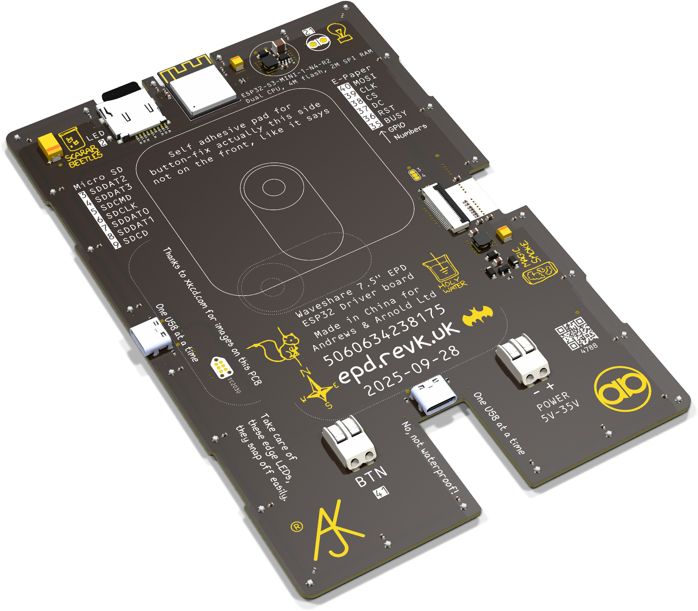

# General E-paper/OLED/LCD signage

## Trademark

This is an open source project, but bear in mind you cannot sell boards bearing the Andrews & Arnold Ltd name, the A&A logo, the registered trademark AJK logo, or the GS1 allocated EANs assigned to Andrews & Arnold Ltd.

## Buy?

This code works with many E-paper panels, and LC Displays, but I have bought up some really nice 7.5" Waveshare ones on laminated glass with black border, and have them on Tindie with my controller (this code pre-loaded). [Tindie](https://www.tindie.com/products/revk/75-e-paper-controller-24-leds-sd-card-slot/) but you can also order direct if you have an A&A account, and even collect if in South Wales!

## Environmental monitoring

This code also supports a range of sensors listed below, for light, sound, temperature, gas, pressure, etc. These can be used for display but also logging (MQTT) and polling (http). This makes it idea for a display and monitor. The [FaikinRemote](https://remote.revk.uk) project has an ideal colour display with many sensors for this purpose.

# ESP32-EPD

This uses my [ESP32-GFX](https://gfx.revk.uk/) library and provides a general E-paper, OLED, and LCD, sign with a configurable selection of *widgets*.

*This is the new version of my `EPDSign` code which had a few options (clock, date, day, wifi and QR, background images, etc). Please upgrade to this as EPD-SIGN is no longer maintained.*

This code is much more generic, allowing a number of *widgets* to be applied to the displayed images one after the other, this allowing the overall image to be constructed to suit any need.

## PCBs


A number of PCBs designs are included. The most work on this code as been done using the `EPD75` (mono) display, and the `LCD2` and `LCD24` format colour LCD displays. Other displays 
simply need work on the GFX library now as needed, but should work with a range of different display types and models quite easily. 

## LEDs

You can set LED by `command/EPD/rgb` and a string of LED colour letters.

## Override

You can send `comamnd/EPD/override` with a URL or image file name to override the display for 60 seconds.

## Widgets

Each widget has basic settings with *type*, and position (*x*/*y*), and alignment (*left*/*centre*/*right* and *top*/*middle*/*bottom*) and the *size* of the widget, and, of course a *content* setting. Some widgets may reference other settings as well in the way they work.

### Content

The *content* for any widget can contain `$` expanded fields, this can be `$variable` or `${variable}` if you need letters/etc directly after the expansion, or need to add extra formatting. The *variable* is a letter and then letters or digits. Use `$$` if you want an actual `$`.

Using `${variable}` you can append the variable name with.

- `:format` for any time based variables, for `strftime` formatting, e.g. `${TIME:%a %:%M}` may show `Wed 10:15`, and optionally ending with `+HHMM` or `-HHMM` or `Z` to set time zone
- `.fields` for any JSON based variables, allows the JSON field, e.g. `${WEATHER.current.condition.code}`
- `.field:format` will allow some formatting of fields from JSON based variables.

|Variable|Meaning|
|------|-------|
|`TIME`|Current time (`HH:MM` for epaper, `HH:MM:SS` otherwise)|
|`DATE`|Current date `YYYY-MM-DD`|
|`DAY`|Current day, e.g. `WEDNESDAY` (this is not strftime based)|
|`SEASON`|Seasonal character code, e.g. `E` for Easter - is the primary season code at current time|
|`SEASONS`|Seasonal character codes, as occasionally there may be more than one active|
|`COUNTDOWN`|Countdown/up from `refdate`, not a `refdate` with year `0000` means countdown to date/time specified in current/next year|
|`ID`|Device ID|
|`HOSTNAME`|Hostname|
|`SSID`|Current WiFi SSID (can be configured or use the WiFi settings)|
|`PASS`|Current WiFi passphrase (can be configured or use the WiFi settings)|
|`WIFI`|QR code formatted current WiFi details `$SSID` and `$PASS` info|
|`IPV6`|Current main public IPv6 (also `$IP`)|
|`IPV4`|Current IPv4|
|`SUNRISE`|Next sunrise (HH:MM), needs `poslat` and `poslon` set.|
|`SUNSET`|Next sunset (HH:MM), needs `poslat` and `poslon` set.|
|`FULLMOON`|Next full moon (YYYY-MM-DD HH:MM)|
|`NEWMOON`|Current new moon (YYYY-MM-DD HH:MM), before or after now, changes on next full moon - may be changed some time|
|`MOONPHASEn`|Moon phase from 0=full moon, `$MOONPHASE` is 0 to 359. `$MOONPHASEn` is 0 to (n-1)|
|`SNMPHOST`|Hostname reported from SNMP poll|
|`SNMPDESC`|Description reported from SNMP poll|
|`SNMPFBVER`|FireBrick version from description reported from SNMP poll|
|`SNMPUPTIME`|Uptime reported from SNMP poll|
|`WEATHER`|Extract a field from weather api response JSON, suffix `:128` finds `64x64` and replaces with `128x128`, e.g. `https:${WEATHER.current.condition.icon:128}`|
|`SOLAR`|Extract a field from SolareEdge MODBUS TCP collection generated JSON|
|`MQTTn`|Extract a field from JSON payload payload on subscribed MQTT (`jsonsub`)|
|`API`|JSON payload from generic API URL|

#### Sensors

The code supports a number of sensors which can be configured on I2C (or one wire bus). These provide values as follows as JSON values (also MQTT logged in `status`). As default field is defined as well, e.g. `$MCPA9808.C`, or `$MCP9808`, or `$TEMPERATURE.C`, or `$TEMPERATURE` will all give current Celsius temperature if you are using an `MCP9808`.

|Variable|Meaning|
|--------|-------|
|`MCP9808`|`C` Celsius|
|`TMP1075`|`C` Celsius|
|`SHT40`|`C` Celsius, `RH` is humidity|
|`DS18B20`|`[0].C` is Celsius for first sensor, `[n].serial` is serial number of sensor|
|`SCD41`|`ppm` is CO₂, ,`C` is Celsius, `RH` is humidity|
|`T6793`|`ppm` is CO₂|
|`T3902`|`noise` with mean and peak for 1, 10 and 60 second periods|
|`GZP6818D` or `PRESSURE`|`hPa` is pressure, `C` is Celsius|
|`VEML6040` or `LIGHT`|`W` is white, `R` is red, `G` is green, `B` is blue, values in lux|
|`TEMPERATURE`|Picks `SCD41`, `DS18B20`, `MCP9808` or `TMP1075`|
|`CO2` or `CO₂`|Picks `SCD41` or `T6793`|
|`HUMIDITY`|Picks `SCD41`|
|`BLE`|BLE tracking sensors array (enable BLE to allow a number of sensors to be added)|

All sensors are included in MQTT `state` message, and can be fetched by web from `/status`.

#### Buttons

Buttons can be added as inputs, and these are used as HA triggers.

#### Numeric JSON value formats

|Tag|Meaning|
|---|-------|
|*digits*|Set number of places|
|*digits*.|Set total digits (use default places)|
|0*digits*.|Set total digits (use default places) but leading zeros|
|*digits*.*digits*|Set total digits and number of places|
|0*digits*.*digits*|Set total digits and number of places but apply leading zeros|
|`k`|Divide by 1000|
|`M`|Divide by 1000000|
|`m`|Multiply by 1000|
|`u`|Multiply by 1000000|
|`K`|Change Celsius to Kelvin|
|`F`|Change Celsius to Fahrenheit|
|`C`|Change Fahrenheit Celsius|
|`=`n|Set a target value n (digits)|
|`±`n|Set a margin for target (default 5)|

Setting a target overrides foreground colour to red if over target+margin or blue if below target-margin, else unchanged from settings for widget

### Text

This is one of the simplest widgets, and allows simple multi line text to be displayed. The font size defines the text size, with `1` being one pixel per 5x9 matrix image. The system uses a vector based font, and the *size* has modifers for allowing space below for descenders, and light weight vector lines.

Note that text is normally fixed space font with a small number of exceptions (`.`, `:`, `|`, `!`). Options may be added to force fixed space and maybe allow more proportional spaced characters at some point.

A wide range of accented characters are supported based on Mullard SAA5050 teletext controller fonts with some additional characters. Notably this includes `°` to use with `°C` or `°F`.

In future I may add red text as an option for KWR displays.

Extra flags can be added to the size.

|Flag|Meaning|
|----|-------|
|`_`|Allow space for descenders|
|`\|`|Lighter stroke|
|`/`|Italic (this is best when using colour displays as anti-aliased)|

### Blocky

Same as `text` but blocky (pixel based) characters.

|Flag|Meaning|
|----|-------|
|`_`|Allow space for descenders|
|`\|`|Smaller spaced out squares|
|`/`|Dots not squares|

### Digits

Display content using classic 7 segment display format.

This is ideal for `$DATE` and `$TIME`. For solid colour e-paper, this plots only the segments as black or white (see *mask* below), no overall background, otherwise the background is plotted as a box like text (unless mask).

Only a single line is handled, and a limited character set:

- `0` to `9` as you would expect as normal 7 segment digits.
- Simple symbols like `-` and `_`.
- Some letters, notably for hex `A`-`F` as `A`, `b`, `C`, `d`, `E`, `F`. This also helps with temp using `C` and `F`.
- Use of `.` or `:` after a displayed character causes the previous character to be wider to allow `.` and `:` after it. This can follow a space if you needed. This may be tweaked in future.

Whilst vector based text allows any size, the 7 segment logic currently allows sizes up to 20, which allows 2 digits, colon, and 2 digits to just fit within 480 pixels width on a 7.5" e-paper panel in portrait. 

Extra flags can be added to the size.

|Flag|Meaning|
|----|-------|
|`_`|Smaller digits after `.`|
|`\|`|Smaller digits after `:`|
|`/`|Italic (this is best when using colour displays as anti-aliased)|

Note that with `_` a trailing `C` or `F` is handled as superscript for temperatures.

### Image

This can be `http://` URL serving a PNG image, or just the end appended to `baseurl`. It is recommended that this is 1 bit indexed, but can be any valid PNG (memory permitting). It can include *alpha* channel to control if plotted (cuts at 50%.

The image is typically stored in SD card if present as a backup. If the image is not a URL, then the SD card is checked anyway.

Note, if the image does not end `.`*something* (and has no `?`) a `.png` is appended.

In future I hope to isolate black, white, and red for KWR displays.

### QR

The content is content of QR code. The size is normally the overall size in pixels, with the QR scaled to fit within that. There is also a tag to say size is pixel size (pixels per QR unit block). 

Extra flags can be added to the size. The size is normally total pixel size and QR is largest that can uniformly fit in that size.

|Flag|Meaning|
|----|-------|
|`_`|Size is unit size not overall size|
|`\|`|Plot without quiet zone|
|`/`|Special (non standard) QR with dots - better when larger QR|

### HLine/VLine

Draws a single pixel horizontal or virtial line based on size and alignment.

### Bins


This allows display of bin collection. This is based on a JSON file, the content is the URL to fetch the JSON. A script `monmouthire.cgi` is defined for now. The *size* is font size for the bin collection day or week (or `TODAY`/`TOMORROW`) which is shown along with icons.

Top level JSON, specifies next bin collection day.

|Field|Meaning|
|-----|-------|
|`baseurl`|Base URL for icons, default is system wide base url|
|`cache`|Datetime for caching this JSON, default is to `clear`, or 1 hour from last check|
|`display`|Datetime when to display, default 7 days before `collect`|
|`leds`|Datetime for LEDs show, default is 12 hours before `collect`|
|`collect`|Datetime for collection, e.g. Monmouthshire is at `07:00:00` on collection day|
|`clear`|Datetime to clear dispaly, default is 12 hours after `collect`|
|`bins`|Array of bin objects for next collection|

Bins array has objects, and can have an empty object if needed (useful as arrays cannot have trailing commas).

|Field|Meaning|
|-----|-------|
|`name`|Name of bin, used as default if icon cannot be shown - so could be `Black`, or `General`, etc.|
|`colour`|Colour letter for LEDs|
|`icon`|Icon URL for PNG icon, can be tail url from `baseurl`|

Example.

```
{
	"baseurl":"http://epd.revk.uk",
	"collect":"2025-03-05 07:00:00",
	"clear":"2025-03-05 12:00:00",
	"bins":[
		{"name":"RED","colour":"R","icon":"Red.png"},
		{"name":"PURPLE","colour":"M","icon":"Purple.png"},
		{"name":"BLUE","colour":"B","icon":"Blue.png"},
		{}
	]
}
```

### Clock

Simple analogue clock face - default is current time,. but you can specify HH:MM or HH:MM:SS in content, e.g. using `$SUNSET` etc.

|Flag|Meaning|
|----|-------|
|`_`|Circle around clock and fill background|
|`\|`|Tick marks on hour|
|`/`|Numbers on hour|

### IR

Infrared remote logic - reporting common IR remote key presses as device automation to HA.

### More

More widgets planned, and more `$variable` planned.

## Message

You can send an MQTT command `override` with a URL/image. This displays an image for a short period (configurable).

You can send an MQTT command `message` with a message string (see [https://gfx.revk.uk/](GFX) for details of `gfx_message` format. This displays a message for a short period (configurable).

## Weather

You can set the weather api for use with [https://www.weatherapi.com/](https://www.weatherapi.com/) this then allows you to access `$WEATHER` and a weather app field. e.g. `${WEATHER.current.feelslike_c}C` or `${WEATHER.current.condition.text}`

Sending the `command/EPD/weather` returns current weather JSON as an `info` response to help you understand the response fields you can use.

The data requested from the API is `forecast`, so typically includes a `dayforecast`, which can be accessed, e.g. `${WEATHER.forecast.forecastday[0].day.maxtemp_c}`

## Solar

You can set the IP address of your SolarEdge inverter. This uses MODBUS (TCP port 1502) to get key data which is constructed in to a JSON object, with fields such as `$SOLAR.power`, `$SOLAR.today`, etc.

Sending the `command/EPD/solar` returns current solar JSON as an `info` response to help you understand the response fields you can use. You can set `solarlog` to log the data received over MODBUS to MQTT.

## Align, mask, and invert

For most widgets the *x*/*y* and *align* apply as expected. But there is also a mask/invert setting. It is also possible to set a widget relative to previous widget using a *prev* setting on the alignment.

For solid colour e-paper, you can invert the plotting and set a mask. Invert simply swaps black/white. Mask means only plot for asserted colour - content of text or white in am image. However, when dealing with an *image* the mask is not sensible when the PNG image has alpha as that is used as mask. Depending on the display and `gfx.invert` properties images may need to be inverted.

For anti-aliased displays the options are foreground and background colour. Text and digits plot a solid background box first. If no background set then the screen background is used. If no foreground set a contrast black/white is picked. If you set background and foreground the same this is a mask mode.

## Temperature calibration

Temperature is tricky stuff. The actual sensors on the board are very accurate and calibrated, but a key challenge is internal heating and heat from PCB from other components - this means the temperature typically needs some offset applied, and you can only really tell after installing the module, in a case if needed, and running for several minutes to be up to temperature.

For this purpose the on board sensors can have a simple offset added/subtracted to the temperature read, after it is read. For convenience this is in degrees (°C or °F as set).

The most reliable connected sensor is a DS18B20 on a lead as this does not pick up heat from the PCB - do no position above the module to avoid heating by convention. We do not apply an offset to this (let us know if you find a case where that is actually useful). The other reliable sensor is an external BLE sensor - these have such low power usage they do not have internal heating and are also very accurate - again no offset is configurable for these.

The internal sensors (TMP1075 or MCP9808) pick up heat from the PCB and often need several degrees of adjustment. As I say, do this after installing, in case, in position, and running for some time. The pressure sensor also does temperature, but this is right next to the processor, so typically needs way more adjustment.

The SCD41 provides CO₂, temperature, and humidity. Whilst the CO₂ is not affected by temperature, it does have atmospheric pressure adjustment applied automatically from the on board pressure sensor. However the humidity accuracy is impacted by the temperature. As such the temperature offset is initially set in the SCD41 at boot. Any changes to `scd41dt` will apply in real time, but it is recommended that you reboot once you are happy with it to ensure humidity is calculated correctly.
